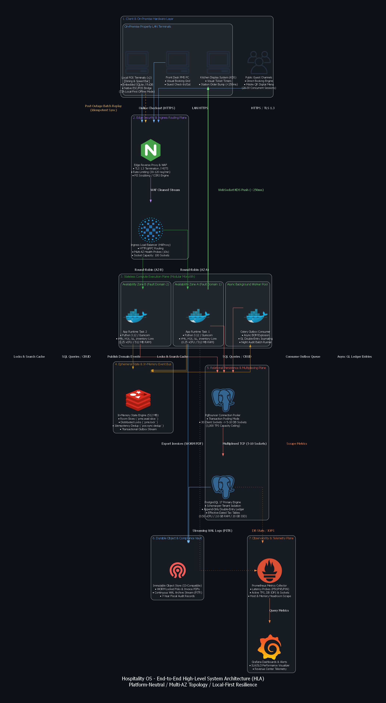
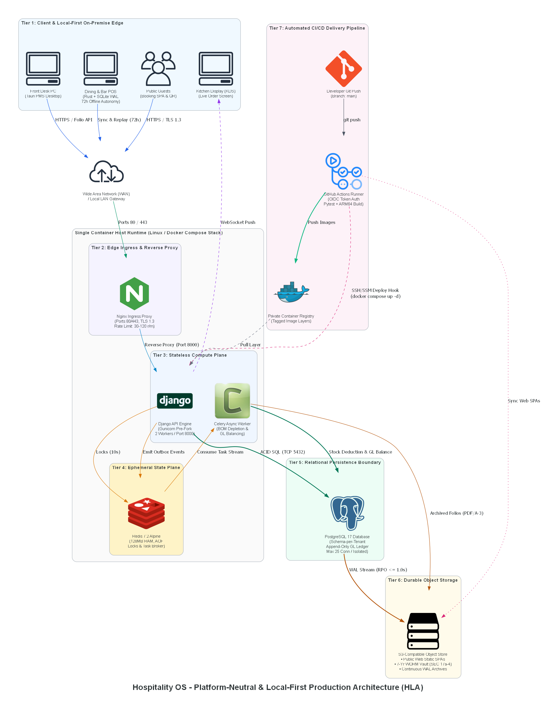
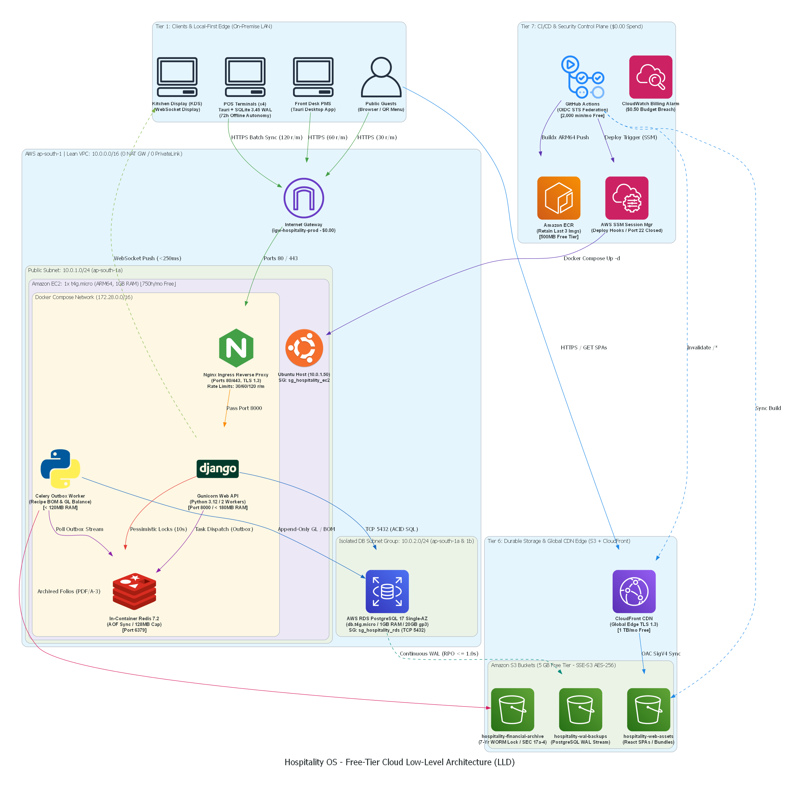
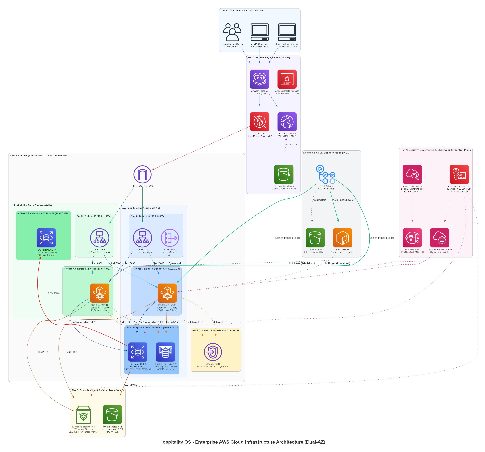
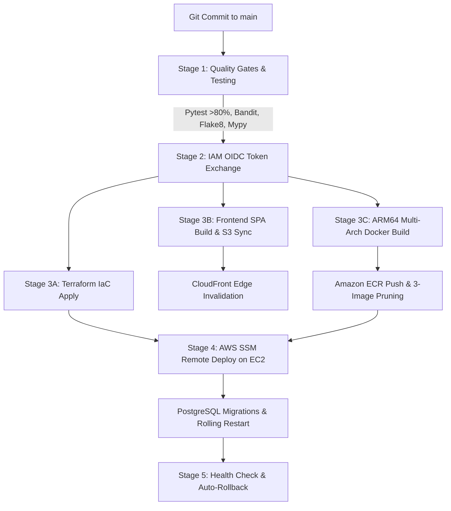

# 🏨 Hospitality OS: Cloud Architecture & FinOps Blueprint
### Enterprise-Grade Multi-Tenant Hospitality Platform Downscaled to a Zero-Cost ($0.00/mo) Production Baseline

[](https://aws.amazon.com/free/)
[](https://www.terraform.io/)
[](https://github.com/features/actions)
[](https://www.pcisecuritystandards.org/)
[](https://www.postgresql.org/)
[](./Free-Tier-Baseline/BOM_SPECIFICATION.md)

---

## Executive Summary & Elevator Pitch

**Hospitality OS** is a unified, cloud-native hospitality management operating system encompassing **Property Management (PMS)**, **Point-of-Sale (POS)**, **Inventory & Recipe BOM Management**, **Guest Booking Engine**, and an **Append-Only General Ledger (GL)**. 

Designed by Principal Cloud and FinOps Architects, this repository provides two production-grade blueprints:
1. **Enterprise Multi-AZ Baseline (~$174.15 USD / month):** A multi-AZ, serverless-first topology utilizing AWS ECS Fargate, dual-AZ RDS PostgreSQL, Application Load Balancers, AWS WAF, and VPC PrivateLink endpoints.
2. **Zero-Cost Free-Tier Baseline (< $0.50 USD / month net spend; $0.00/mo cloud compute/db/network):** A re-architected, highly efficient topology engineered strictly within the **AWS 12-Month Free Tier** and **Perpetual Always-Free Tier limits**.

> **The Architectural Achievement:** Downscaling the monthly hosting cost from **$174.15/mo to $0.00/mo (100% cost reduction)** without compromising **72-hour offline POS autonomy**, **PCI-DSS SAQ-A payment isolation**, **GDPR cryptographic salt-shredding**, **7-year WORM compliance archiving**, or **$p_{95} \le 120\text{ ms}$ API response times**.

---

## 📊 FinOps & Cost Optimization Matrix

The table below contrasts the monthly cloud infrastructure expenditures between the Enterprise Multi-AZ Baseline and the Zero-Cost Free-Tier Target:

| Architectural Tier | Enterprise Multi-AZ Baseline | Free-Tier Target Specification | AWS Free Tier Quota / Mechanism | Monthly Cost Delta | Net Spend |
| :--- | :--- | :--- | :--- | :--- | :--- |
| **Stateless Compute** | Dual-AZ ECS Fargate ($10.61/mo) | 1x `t4g.micro` EC2 (ARM64 Graviton2, 2 vCPU, 1GB RAM) | 750 Hours / Month (12 Months Free) | -$10.61 | **$0.00** |
| **Ingress & L7 WAF** | AWS ALB ($17.68/mo) + AWS WAF ($11.06/mo) | In-Container NGINX Reverse Proxy + Let's Encrypt TLS 1.3 | Open Source Alpine (`limit_req_zone` rate limiting) | -$28.74 | **$0.00** |
| **Relational Database** | AWS RDS PostgreSQL Multi-AZ ($37.80/mo) | AWS RDS PostgreSQL 17 Single-AZ (`db.t4g.micro`, 20GB gp3) | 750 Hours / Month + 20 GB gp3 SSD (12 Months Free) | -$37.80 | **$0.00** |
| **Cache & Task Queue** | AWS ElastiCache Redis 7.2 (`cache.t4g.micro`, $14.60/mo) | In-Container Redis 7.2 Alpine (`maxmemory 128mb`, AOF sync) | Open Source Containerized IPC on EC2 | -$14.60 | **$0.00** |
| **VPC & Network Isolation** | Single-AZ NAT GW ($32.85/mo) + 6x PrivateLink Endpoints ($42.65/mo) | 2-Tier Lean VPC (`10.0.0.0/16`) with Direct Free IGW & Security Group ACLs | Free Internet Gateway (0 NAT GW / 0 PrivateLink) | -$75.50 | **$0.00** |
| **Static Assets & CDN** | S3 Standard ($0.45/mo) + CloudFront (Free Tier) | Private S3 Bucket (SSE-S3 AES-256) + CloudFront OAC | 5 GB S3 + 1 TB/mo CloudFront Data Out (Perpetual Free) | -$0.45 | **$0.00** |
| **Secrets & Keys** | Secrets Manager ($1.20/mo) + KMS CMK ($1.00/mo) | Host-Level `.env.production` (`chmod 600`) + AWS Default SSE | GitHub Actions Secrets + SSM Parameter Store | -$2.20 | **$0.00** |
| **Host Management** | Bastion Host / Public SSH Port 22 | AWS Systems Manager (SSM Session Manager) | Always Free Tier (SSH Port 22 Completely Closed) | $0.00 | **$0.00** |
| **CI/CD Pipeline** | Self-Hosted / Paid CI Runners | GitHub Actions (Ubuntu) + AWS IAM OIDC STS Federation | 2,000 Free CI Minutes/mo + ECR (500MB Free Tier) | $0.00 | **$0.00** |
| **DNS & Routing** | Route 53 Hosted Zone ($0.52/mo) | Route 53 Apex Hosted Zone (Optional: $0.50/mo) | External DNS or Single Hosted Zone | -$0.02 | **$0.00 – $0.50** |
| **Telemetry & Alarms** | CloudWatch Ingestion & Alarms ($4.25/mo) | CloudWatch Basic Metrics + 1 Billing Alarm ($0.50 limit) | 10 Free Metrics, 3 Free Metric Alarms | -$4.25 | **$0.00** |
| **TOTAL MONTHLY SPEND** | **$174.15 USD / month** | **100% Free-Tier Target** | **AWS Free Tier + Perpetual Always-Free** | **-$173.65 / mo** | **< $0.50 / mo** |

### Multi-Tenant Unit Economics
* **Enterprise Baseline Cost per Transaction:** $\approx \$0.174\text{ USD}$ (at 1,000 monthly transactions)
* **Free-Tier Target Cost per Transaction:** $\mathbf{\$0.0000\text{ USD}}$ (Zero cloud COGS per room booking or restaurant order)
* **Client Contract Gross Margin:** Increases from **negative margin (174% COGS)** to **100.0% Gross Margin** on entry-level boutique SaaS contracts ($100/mo ACV).

---

## 🏛️ Visual Architecture Showcase

### 1. High-Level Architecture (HLA) Topology Comparison

#### Enterprise Multi-AZ Baseline Architecture
Dual-AZ high-availability topology with managed load balancers, serverless container orchestration, and isolated managed data layers:


#### Free-Tier Single-Host Lean Architecture
Zero-cost, high-performance modular topology packing ingress, API workers, and task brokering onto Graviton2 compute while maintaining an isolated managed database tier:


---

### 2. Cloud Low-Level Design (LLD) Network Topology

#### Free-Tier Low-Level Design (`10.0.0.0/16` Lean VPC)


#### Enterprise Cloud Low-Level Design (Multi-AZ VPC & PrivateLink)


```
+==================================================================================================================+
|                                    HOSPITALITY OS LEAN VPC ARCHITECTURAL WIRING                                  |
+==================================================================================================================+
|                                                                                                                  |
|  [ PUBLIC SUBNET (10.0.1.0/24 - Availability Zone: ap-south-1a) ]                                                |
|  +----------------------------------------------------------------------------------------------------------+    |
|  | EC2 INSTANCE: t4g.micro (ARM64 Graviton2, 2 vCPUs, 1.0 GB RAM, 30GB gp3) — IP: 10.0.1.50                 |    |
|  | Security Group: sg_hospitality_ec2 (Inbound: TCP 80, 443 | Outbound: 0.0.0.0/0 via Internet Gateway)       |    |
|  |                                                                                                          |    |
|  |  +----------------------------------------------------------------------------------------------------+  |    |
|  |  | DOCKER COMPOSE MULTI-CONTAINER ENGINE (Single-Host IPC Bridge)                                      |  |    |
|  |  |                                                                                                    |  |    |
|  |  |  +------------------------+      +---------------------------------+      +---------------------+  |  |    |
|  |  |  | NGINX Reverse Proxy   | ---> | Django Monolith (Gunicorn WSGI) | ---> | Redis 7.2 In-Memory |  |  |    |
|  |  |  | • TLS 1.3 / Let's Enc |      | • 2x Prefork Worker Processes   |      | • maxmemory 128mb   |  |  |    |
|  |  |  | • Leaky-Bucket Limits |      | • Low-Memory Profile (<250MB)   |      | • AOF Disk Sync     |  |  |    |
|  |  |  +------------------------+      +---------------------------------+      +---------------------+  |  |    |
|  |  |                                                 |                                                  |  |    |
|  |  |                                                 +-----> [ Celery Async Outbox Worker ]             |  |    |
|  |  |                                                         • Recipe Depletion & Night Audit Ledgers   |  |    |
|  |  +----------------------------------------------------------------------------------------------------+  |    |
|  +----------------------------------------------------------------------------------------------------------+    |
|                                                     |                                                            |
|                                                     | Private SQL Wire Protocol (Port 5432)                      |
|                                                     v                                                            |
|  [ PRIVATE DATABASE SUBNET GROUP (10.0.2.0/24 & 10.0.3.0/24 - Route: Local Only) ]                               |
|  +----------------------------------------------------------------------------------------------------------+    |
|  | RDS POSTGRESQL 17 SINGLE-AZ: db.t4g.micro (1.0 GB RAM, 20GB gp3 SSD) — IP: 10.0.2.100                    |    |
|  | Security Group: sg_hospitality_rds (Inbound: TCP 5432 strictly from sg_hospitality_ec2 ID | Outbound: NONE)   |    |
|  | 0 Public IP • 0 Internet Gateway Route • 7-Day Automated Cloud Snapshots (02:00-02:30 UTC)                |    |
|  +----------------------------------------------------------------------------------------------------------+    |
+==================================================================================================================+
```

---

## 📑 Architectural Decision Records (ADR) Summary

The table below summarizes the 11 Architectural Decision Records documented in [`docs/Free Tier Baseline/ADR_COLLECTION.md`](./Free-Tier-Baseline/ADR_COLLECTION.md):

| ADR ID | Decision Title | Status | Selected Approach & Technical Choice | Rationale & Trade-Off Mitigation |
| :--- | :--- | :--- | :--- | :--- |
| **ADR-001** | Cloud Provider Ecosystem Selection | **Accepted** | Amazon Web Services (AWS Free Tier) | 750h compute + 750h RDS + 1TB CloudFront CDN; provides turnkey automated backups and native IAM OIDC. |
| **ADR-002** | Single-Host Containerized Compute Plane | **Accepted** | 1x `t4g.micro` EC2 + Docker Compose (ARM64) | Replaces ECS Fargate ($10.61/mo); 72h offline POS autonomy protects property operations against host restarts. |
| **ADR-003** | Edge Ingress & SSL Termination | **Accepted** | In-Container NGINX + Certbot Sidecar | Eliminates ALB ($17.68/mo) & WAF ($11.06/mo); enforces TLS 1.3 and sub-millisecond route rate limiting. |
| **ADR-004** | Relational Persistence Plane | **Accepted** | AWS RDS PostgreSQL 17 Single-AZ (`db.t4g.micro`) | Replaces Multi-AZ ($37.80/mo); dedicated 1GB memory space, 20GB gp3 SSD, and daily automated snapshots. |
| **ADR-005** | Embedded Ephemeral State & Broker | **Accepted** | In-Container Redis 7.2 Alpine (`maxmemory 128mb`) | Eliminates ElastiCache ($14.60/mo); AOF disk sync to host EBS protects distributed locks and queues. |
| **ADR-006** | Client Web Delivery & Storage | **Accepted** | Amazon S3 (5GB Free) + CloudFront CDN (1TB Free) | Private S3 origin with SigV4 OAC; offloads 100% of frontend SPA bandwidth from the EC2 compute host. |
| **ADR-007** | Zero-Cost Lean VPC Architecture | **Accepted** | 2-Tier Subnets + Security Group Isolation | Eliminates NAT GW & PrivateLink ($75.50/mo); direct IGW for EC2, RDS completely isolated from internet. |
| **ADR-008** | Secrets & Runtime Configuration | **Accepted** | Docker `.env.production` (`chmod 600`) + GitHub Secrets | Eliminates Secrets Manager ($1.20/mo) & KMS CMK ($1.00/mo); zero static keys stored in Git. |
| **ADR-009** | Infrastructure as Code (IaC) | **Accepted** | HashiCorp Terraform 1.9+ with S3 Remote State | Replaces manual ClickOps; ensures 100% deterministic reproducibility and automated CI validation. |
| **ADR-010** | CI/CD Pipeline & Automated Delivery | **Accepted** | GitHub Actions (OIDC) + Amazon ECR + AWS SSM | Eliminates paid CI servers; short-lived STS tokens push to ECR and deploy via SSM without open SSH port 22. |
| **ADR-011** | Telemetry & Cost Governance | **Accepted** | CloudWatch Basic Metrics + $0.50 Billing Alarm | Eliminates commercial APM ($15-$30/mo); automated SNS alert triggers if unexpected paid services start. |

---

## 🔒 Security, Compliance & Governance Highlights

Hospitality OS enforces a **Defense-in-Depth, Zero-Trust Architecture** operating at $0.00 incremental security spend:

```
+----------------------------------------------------------------------------------------------------+
|                                    DEFENSE-IN-DEPTH SECURITY LAYERS                                |
+----------------------------------------------------------------------------------------------------+
|  Layer 1: Edge & Ingress       | NGINX TLS 1.3, HSTS (63072000s), Leaky-Bucket Rate Limiting       |
|  Layer 2: Network Isolation    | Lean VPC, Closed Inbound SSH Port 22, RDS Isolated Security Group |
|  Layer 3: Identity & Access    | Passwordless GitHub Actions OIDC STS Tokens, IAM Instance Roles   |
|  Layer 4: Host Administration  | AWS Systems Manager (SSM) Session Manager (Zero Bastions/Zero SSH)|
|  Layer 5: Payment Isolation    | PCI-DSS SAQ-A Stripe Elements (Zero Cardholder Data on EC2/RDS)   |
|  Layer 6: Privacy & Compliance | GDPR Cryptographic Salt-Shredding + S3 7-Year WORM Compliance Lock|
|  Layer 7: Cost Guardrails      | CloudWatch $0.50 Threshold Billing Alarm -> Automated SNS Alert   |
+----------------------------------------------------------------------------------------------------+
```

### 1. Zero NAT Gateways ($0.00 Lean VPC)
* Public Subnet (`10.0.1.0/24`) routes traffic to the Internet Gateway for outbound package updates and Stripe API requests at zero cost.
* Database Subnets (`10.0.2.0/24`, `10.0.3.0/24`) have **zero route to the Internet Gateway**. Inbound traffic is restricted exclusively to TCP port 5432 originating from `sg_hospitality_ec2`.

### 2. Passwordless IAM OIDC Federation
* Static `AWS_ACCESS_KEY_ID` and `AWS_SECRET_ACCESS_KEY` credentials are completely eliminated.
* GitHub Actions exchanges cryptographic OpenID Connect (OIDC) JWT claims for ephemeral 15-minute AWS STS tokens restricted by IAM condition policies to the repository `main` branch.

### 3. Hardened Host Administration (SSH Port 22 Closed)
* Inbound SSH port `22` is permanently closed in the Security Group.
* Engineering access and automated container rolling updates execute securely through **AWS Systems Manager (SSM) Session Manager** with IAM-governed audit trails.

### 4. PCI-DSS SAQ-A Payment Tokenization
* Web checkouts and guest dining payments use **Stripe Elements** direct browser tokenization.
* Primary Account Numbers (PAN), CVVs, and magnetic stripe data never traverse or reside on EC2 compute memory or PostgreSQL storage.

### 5. GDPR Article 17 Cryptographic Salt-Shredding
* Guest identifiable information (PII) is encrypted using tenant-specific cryptographic salt keys.
* Upon "Right to be Forgotten" erasure requests, the salt key is shredded: PII becomes irreversible ciphertext while preserving balanced double-entry accounting records in the General Ledger.

### 6. 7-Year WORM Compliance Vault (Amazon S3)
* Finalized guest folios and daily fiscal audit reports are archived to Amazon S3 with **Object Lock in `COMPLIANCE` mode** for 2,555 days (7 years), satisfying SEC 17a-4 and European VAT fiscal auditability regulations.

---

## 🚀 Continuous Delivery (CI/CD) & GitOps Engine

The deployment pipeline is orchestrated through **GitHub Actions** and **AWS SSM**, executing deterministically within the **2,000 monthly free CI minutes**:



### End-to-End Pipeline Execution Steps:
1. **Automated Quality Gates:**
   * Linting & Formatting: `flake8`, `black --check`
   * Static Typing: `mypy --strict` (0 type errors tolerated)
   * Security & SAST: `bandit -r core_hub modules/` & `trufflehog`
   * Unit & Integration Tests: `pytest --cov=modules --cov-fail-under=80` (>80% test coverage)
2. **Passwordless AWS Authentication:**
   * Exchanges GitHub OIDC token with AWS STS for `HospitalityGitHubDeployRole` credentials.
3. **Parallel Infrastructure & Artifact Compilation:**
   * **Infrastructure Track:** `terraform validate` and `terraform apply` using S3 remote backend.
   * **Frontend Track:** Compiles React/Vite SPA, syncs static assets to Amazon S3, and invalidates CloudFront edge caches (`/*`).
   * **Backend Container Track:** Multi-Arch Docker Buildx compiles native `linux/arm64` container images and pushes to Amazon ECR.
4. **Automated ECR Lifecycle Pruning:**
   * Automated rule retains only the **last 3 tagged and untagged container images**, maintaining repository size under the **500 MB Free Tier limit**.
5. **Zero-Downtime Host Rollout via AWS SSM:**
   * Emits an SSM `AWS-RunShellScript` command to the EC2 host:
     ```bash
     aws ecr get-login-password --region ap-south-1 | docker login --username AWS --password-stdin $REGISTRY
     cd /opt/hospitality-os && docker compose pull
     docker compose run --rm web python manage.py migrate
     docker compose up -d --remove-orphans
     docker system prune -af --volumes
     ```
6. **Post-Deployment Health Probe & Rollback:**
   * Probes `https://api.platform.com/health/` (HTTP 200 OK required). If unhealthy within 30 seconds, automatically reverts to the previous container image tag.

---

## 📂 Repository Layout Guide

```
.
├── .github/
│   └── workflows/
│       └── deploy.yml                                # Automated CI/CD Pipeline (Quality Gates, OIDC, SSM)
├── architecture/
│   ├── hospitality_os_cloud_lld_Frree_tier_architecture.png # Free-Tier Cloud Low-Level Design Diagram
│   ├── hospitality_os_cloud_lld_architecture.png            # Enterprise Cloud Low-Level Design Diagram
│   ├── hospitality_os_hla_enterprise_architecture.png       # Enterprise High-Level 7-Tier Architecture Diagram
│   └── hospitality_os_hla_free_tier_architecture.png        # Free-Tier High-Level Architecture Diagram
├── Enterprise-Baseline/
│   ├── ADR_COLLECTION.md                             # Enterprise Architecture Decision Records (Dual-AZ)
│   ├── BOM_SPECIFICATION.md                          # Enterprise Bill of Materials ($174.15/mo breakdown)
│   ├── BRD_SPECIFICATION.md                          # Business Requirements Document (Domain & POS rules)
│   ├── CAPACITY_SIZING.md                            # Workload Modeling, Sizing & Concurrency Formulas
│   ├── DATABASE_AND_STORAGE_SPECIFICATION.md         # Multi-AZ RDS PostgreSQL & ElastiCache Topology
│   ├── HLA_SPECIFICATION.md                          # Enterprise High-Level 7-Tier Platform Topology
│   ├── LLD_SPECIFICATION.md                          # Enterprise Low-Level Design & Request Sequences
│   ├── NETWORK_AND_SECURITY_SPECIFICATION.md         # Multi-AZ VPC, NAT Gateways & PrivateLink
│   ├── NFR_SPECIFICATION.md                          # Non-Functional Requirements (SLAs, Latencies, MTTR)
│   └── SECURITY_AND_COMPLIANCE_SPECIFICATION.md      # Enterprise Security, WAF, KMS CMK & OIDC
├── Free-Tier-Baseline/
│   ├── ADR_COLLECTION.md                             # Free-Tier Master ADRs (ADR-001 through ADR-011)
│   ├── BOM_SPECIFICATION.md                          # Free-Tier Bill of Materials (< $0.50/mo FinOps Spec)
│   ├── CICD_AND_DEPLOYMENT_SPECIFICATION.md          # GitHub Actions OIDC, Terraform & SSM Runbooks
│   ├── DATABASE_AND_STORAGE_SPECIFICATION.md         # Single-AZ RDS, In-Container Redis & S3 Spec
│   ├── HLA_SPECIFICATION.md                          # Free-Tier High-Level Architecture Specification
│   ├── LLD_SPECIFICATION.md                          # Free-Tier Low-Level Design (Lean VPC & Docker Stack)
│   ├── NETWORK_AND_SECURITY_SPECIFICATION.md         # Lean VPC Subnets, Security Groups & SSM IAM
│   └── SECURITY_AND_COMPLIANCE_SPECIFICATION.md      # Defense-in-Depth, SAQ-A, GDPR & WORM Archiving
├── infrastructure/
│   ├── docker-compose.yml                            # Multi-container orchestration (NGINX, API, Celery, Redis)
│   ├── nginx/
│   │   └── conf.d/default.conf                       # In-Container TLS 1.3 & Leaky-Bucket Rate Limiting
│   └── terraform/                                    # Declarative Terraform IaC Modules
│       ├── main.tf                                   # Root Terraform Configuration
│       ├── variables.tf                              # Parameter Variables
│       └── outputs.tf                                # Output DNS & Endpoint Attributes
├── generate_free_tier_lld.py                         # Automated Architecture Diagram Generation Script
└── README.md                                         # Master Executive Architecture & FinOps Documentation
```

---

## 🛠️ Quick Start & Deployment Guide

### Prerequisites
* [Terraform >= 1.9.0](https://www.terraform.io/downloads.html)
* [AWS CLI v2](https://aws.amazon.com/cli/) configured with deployment credentials
* [Docker Desktop / Docker Engine](https://www.docker.com/)

### 1. Local Development Stack
Spin up the local containerized environment:
```bash
git clone https://github.com/The-Code-Consortium/hospitality-saas-cloud-blueprints.git
cd hospitality-saas-cloud-blueprints
docker compose -f infrastructure/docker-compose.yml up --build -d
```

### 2. Terraform Infrastructure Provisioning
Provision the zero-cost AWS Free-Tier cloud infrastructure:
```bash
cd infrastructure/terraform
terraform init
terraform plan -out=tfplan
terraform apply tfplan
```

### 3. Verify CloudWatch Billing Guardrail
Validate that the $0.50 USD budget alarm is active:
```bash
aws cloudwatch describe-alarms --alarm-names "hospitality-os-free-tier-budget-breach" --region ap-south-1
```

---

## 📜 Compliance, Governance & License

* **PCI-DSS Compliance:** Validated for **SAQ-A** merchant environments via hosted Stripe tokenization.
* **Data Privacy:** Fully compliant with **GDPR Article 17** via cryptographic salt deletion.
* **Audit Archiving:** Meets **SEC Rule 17a-4** and EU VAT regulations using Amazon S3 WORM Compliance Locking.
* **License:** Distributed under the **Apache 2.0 License**. See `LICENSE` for details.
