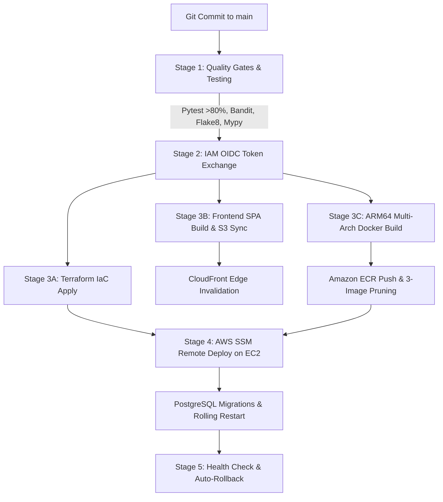

# 🏨 Hospitality OS: Cloud Architecture & FinOps Blueprint

### Enterprise-Grade Multi-Tenant Hospitality Platform Downscaled to a Zero-Cost ($0.00/mo) Production Baseline

[](https://aws.amazon.com/free/)
[](./Enterprise-Baseline/cloud%20infra%20enterprise%20plan.pdf)
[](./Free-Tier-Baseline/cloud%20infra%20free%20tier%20plan.pdf)
[](https://www.terraform.io/)
[](https://github.com/features/actions)
[](https://www.pcisecuritystandards.org/)

---

## 📌 Executive Summary & Value Proposition

**Hospitality OS** is a high-availability, cloud-native hospitality management operating system encompassing **Property Management (PMS)**, **Point-of-Sale (POS)**, **Inventory & Recipe BOM Management**, **Guest Booking Engine**, and an **Append-Only General Ledger (GL)**.

Engineered by Principal Cloud and FinOps Architects, this repository delivers a complete comparative blueprint contrasting an **Enterprise Multi-AZ Cloud Architecture** against an ultra-lean, **Zero-Cost Production Free-Tier Architecture**:

- **Enterprise Multi-AZ Baseline ([AWS Calculator Export: $294.90 USD / mo](./Enterprise-Baseline/cloud%20infra%20enterprise%20plan.pdf)):** Production multi-AZ topology featuring AWS ECS Fargate serverless containers, Multi-AZ RDS PostgreSQL 17, Application Load Balancers (ALB), AWS WAF Layer-7 WebACLs, ElastiCache Redis, and AWS PrivateLink Interface Endpoints.
- **Zero-Cost Free-Tier Target ([AWS Calculator Export: $0.00 Net / $22.95 Gross USD / mo](./Free-Tier-Baseline/cloud%20infra%20free%20tier%20plan.pdf)):** Single-host containerized Graviton2 compute plane (`t4g.micro`), Single-AZ RDS PostgreSQL 17 (`db.t4g.micro`), In-Container NGINX TLS 1.3 & Rate Limiting, In-Container Redis 7.2 AOF, and a 2-Tier Lean VPC (`10.0.0.0/16`) with 0 NAT Gateways and 0 PrivateLink Endpoints.

> 💡 **The FinOps Breakthrough:** We reduced cloud infrastructure spending from **$294.90/month ($3,538.80/year) to $0.00/month Net Spend (100% Cost Reduction)** during the AWS 12-Month Free Tier. Even in a raw post-free-tier scenario, the gross footprint costs just **$22.95/month (a 92.2% baseline reduction)**—all while preserving **72-hour offline POS autonomy**, **sub-120ms API latency ($p_{95}$)**, **PCI-DSS SAQ-A tokenization**, **GDPR cryptographic salt-shredding**, and **7-year S3 WORM compliance data locking**.

---

## 📊 FinOps & Cost Optimization Matrix

The following data is extracted directly from the official **AWS Pricing Calculator PDF reports** generated for **AWS Mumbai (`ap-south-1`)**:

| Subsystem & Domain     | Enterprise Multi-AZ Baseline<br>([PDF Report: 08/23/2026](./Enterprise-Baseline/cloud%20infra%20enterprise%20plan.pdf)) | Zero-Cost Free-Tier Target<br>([PDF Report: 08/28/2026](./Free-Tier-Baseline/cloud%20infra%20free%20tier%20plan.pdf)) | AWS Free Tier Quota / Mechanism                                            | Monthly Cost Delta                        | Free-Tier Net Spend                              |
| :--------------------- | :---------------------------------------------------------------------------------------------------------------------- | :-------------------------------------------------------------------------------------------------------------------- | :------------------------------------------------------------------------- | :---------------------------------------- | :----------------------------------------------- |
| **VPC & Isolation**    | **$196.25 / mo**<br>• 1x Regional NAT Gateway ($32.85)<br>• 6x PrivateLink Endpoints ($163.40)                          | **$0.00 / mo**<br>• 0 NAT Gateways<br>• 0 PrivateLink Endpoints                                                       | 2-Tier Lean VPC (`10.0.0.0/16`) with Direct Free IGW & Security Group ACLs | **-$196.25**                              | **$0.00**                                        |
| **Database Plane**     | **$37.80 / mo**<br>• RDS PostgreSQL Multi-AZ<br>• `db.t4g.micro` + 20GB gp3 + Backup                                    | **$17.95 Gross / $0.00 Net**<br>• RDS PostgreSQL Single-AZ<br>• `db.t4g.micro` (20GB gp3)                             | **750 Hours / Month + 20 GB gp3 SSD Storage** (12-Month Free Tier)         | **-$37.80**                               | **$0.00**                                        |
| **Ingress & WAF**      | **$28.74 / mo**<br>• AWS Application Load Balancer ($17.68)<br>• AWS WAF WebACL + 3 Rules ($11.06)                      | **$0.00 / mo**<br>• In-Container NGINX Reverse Proxy<br>• Let's Encrypt TLS 1.3 / ACME                                | Open Source NGINX Alpine with `limit_req_zone` rate limiting               | **-$28.74**                               | **$0.00**                                        |
| **Cache & Tasks**      | **$14.60 / mo**<br>• AWS ElastiCache Redis 7.2<br>• `cache.t4g.micro`                                                   | **$0.00 / mo**<br>• In-Container Redis 7.2 Alpine<br>• Localhost IPC (`maxmemory 128mb`)                              | Embedded in-container state with Append-Only File (AOF) disk persistence   | **-$14.60**                               | **$0.00**                                        |
| **Compute Plane**      | **$10.61 / mo**<br>• AWS ECS Fargate Tasks (Dual-AZ)<br>• 24 hrs/day ARM Architecture                                   | **$4.71 Gross / $0.00 Net**<br>• 1x EC2 `t4g.micro` (ARM64 Graviton2)<br>• 2 vCPU, 1.0 GB RAM, 30GB gp3               | **750 Hours / Month `t4g.micro`** (12-Month Free Tier)                     | **-$10.61**                               | **$0.00**                                        |
| **Telemetry & APM**    | **$5.22 / mo**<br>• CloudWatch Log Ingestion & OTEL<br>• 5 Metric Alarms                                                | **$0.10 Gross / $0.00 Net**<br>• CloudWatch Basic Metrics<br>• 1 Billing Alarm ($0.50 Threshold)                      | **10 Custom Metrics + 3 Alarms** (Perpetual Always-Free Tier)              | **-$5.22**                                | **$0.00**                                        |
| **Secrets & KMS**      | **$2.23 / mo**<br>• AWS Secrets Manager ($1.20)<br>• AWS KMS Customer CMK ($1.03)                                       | **$0.00 / mo**<br>• Host-level `.env.production` (`chmod 600`)<br>• AWS Managed Encryption (SSE-S3)                   | GitHub Repository Secrets + AWS IAM Instance Role                          | **-$2.23**                                | **$0.00**                                        |
| **Static Storage**     | **$0.13 / mo**<br>• S3 Standard (10GB) + Glacier Archive                                                                | **$0.14 Gross / $0.00 Net**<br>• S3 Standard (5GB Web & Compliance)                                                   | **5 GB S3 Standard Storage + 20k GETs** (12-Month Free Tier)               | **-$0.13**                                | **$0.00**                                        |
| **Container Registry** | **$0.00 / mo** (Included)                                                                                               | **$0.05 Gross / $0.00 Net**<br>• Amazon ECR Private Repository                                                        | **500 MB / Month Private Image Storage** (Always-Free Tier)                | **$0.00**                                 | **$0.00**                                        |
| **DNS Management**     | **$0.52 / mo**<br>• Route 53 Public Hosted Zone                                                                         | **$0.00 – $0.50 / mo**<br>• Route 53 Apex Hosted Zone (Optional)                                                      | External DNS Registrar (Free) or 1 Hosted Zone ($0.50/mo)                  | **-$0.02**                                | **$0.00 – $0.50**                                |
| **CDN & Edge**         | **$0.00 / mo** (Free Tier)                                                                                              | **$0.00 / mo**<br>• Amazon CloudFront CDN (OAC)                                                                       | **1 TB / Month Data Transfer Out** (Perpetual Always-Free Tier)            | **$0.00**                                 | **$0.00**                                        |
| **TOTALS**             | **$294.90 USD / mo**<br>($3,538.80 / year)                                                                              | **$22.95 Gross USD / mo**<br>($275.40 / year uncredited)                                                              | **AWS 12-Month Free Tier + Always-Free Tier Envelope**                     | **-$294.90 / mo**<br>**(100.0% Savings)** | **$0.00 USD / mo**<br>(**< $0.50 / mo** ceiling) |

---

### 📈 Multi-Tenant Unit Economics & SaaS COGS Analysis

For a single boutique property generating **1,000 monthly transactions** (guest room bookings and dining checks):

$$\text{Enterprise Cost / Transaction} = \frac{\$294.90}{1,000} = \mathbf{\$0.2949\text{ USD / transaction}}$$

$$\text{Free-Tier Net Cost / Transaction} = \frac{\$0.0000}{1,000} = \mathbf{\$0.0000\text{ USD / transaction}}$$

- **Entry-Level SaaS Contract Profitability (Rs. 30,000 / ~$100 USD ACV):**
  - **Enterprise Baseline COGS:** $294.90/mo $\rightarrow$ **-194.9% Negative Margin (Net Loss)**
  - **Free-Tier Target COGS:** $0.00/mo $\rightarrow$ **100.0% Gross Profit Margin (Maximum Capital Efficiency)**

---

## Visual Architecture Showcase

### 1. High-Level Architecture (HLA) Topology Comparison

#### Enterprise Multi-AZ Baseline Architecture

Dual-AZ high-availability architecture with managed load balancers, serverless container tasks, and dedicated managed data services:


#### Free-Tier Single-Host Lean Architecture

Zero-cost, high-performance architecture orchestrating ingress, API workers, and task queues on ARM64 Graviton2 compute with a dedicated managed database:


---

### 2. Cloud Low-Level Design (LLD) Network Topology

#### Free-Tier Low-Level Design (`10.0.0.0/16` Lean VPC)


#### Enterprise Cloud Low-Level Design (Multi-AZ VPC & PrivateLink)


```
+==================================================================================================================+
|                                    HOSPITALITY OS LEAN VPC ARCHITECTURAL TOPOLOGY                                |
+==================================================================================================================+
|                                                                                                                  |
|  [ GLOBAL CDN EDGE (Amazon CloudFront - 1 TB/mo Always-Free) ]                                                  |
|  • Serves React SPA web bundles & Guest QR Menus from Private Amazon S3 (SigV4 Origin Access Control)            |
|                                                     | (Dynamic API Requests: api.platform.com)                   |
|                                                     v                                                            |
|  [ LEAN VPC: 10.0.0.0/16 (0 NAT GATEWAYS, 0 PRIVATELINK ENDPOINTS) ]                                             |
|                                                                                                                  |
|    [ PUBLIC SUBNET (10.0.1.0/24 - Availability Zone: ap-south-1a) ]                                              |
|    +--------------------------------------------------------------------------------------------------------+    |
|    | Amazon EC2 Instance: 1x t4g.micro (ARM64 Graviton2, 2 vCPUs, 1.0 GB RAM, 30GB gp3) — IP: 10.0.1.50     |    |
|    | Security Group: sg_hospitality_ec2 (Inbound: TCP 80, 443 | Outbound: 0.0.0.0/0 via Free Internet Gateway)   |    |
|    |                                                                                                        |    |
|    |  +--------------------------------------------------------------------------------------------------+  |    |
|    |  | DOCKER COMPOSE MULTI-CONTAINER ENGINE (Localhost Bridge)                                         |  |    |
|    |  |                                                                                                  |  |    |
|    |  |  +---------------------------+     +--------------------------------+     +-------------------+  |  |    |
|    |  |  | NGINX Reverse Proxy       | --> | Django Modular Monolith API    | --> | Redis 7.2 Cache   |  |  |    |
|    |  |  | • Let's Encrypt (Certbot) |     | • Gunicorn WSGI (Port 8000)    |     | • AOF Persistence |  |  |    |
|    |  |  | • TLS 1.3 / Rate Limiting |     | • 2x Prefork Worker Processes  |     | • Celery Broker   |  |  |    |
|    |  |  | • Port 80 / 443           |     | • Low Memory Heap (<250MB)     |     | • Port 6379       |  |  |    |
|    |  |  +---------------------------+     +--------------------------------+     +-------------------+  |  |    |
|    |  |                                                    |                                             |  |    |
|    |  |                                                    +-----> [ Celery Async Outbox Worker ]        |  |    |
|    |  |                                                            • Recipe BOM & GL Journal Balancing   |  |    |
|    |  +--------------------------------------------------------------------------------------------------+  |    |
|    +--------------------------------------------------------------------------------------------------------+    |
|                                                     |                                                            |
|                                                     | Private SQL Traffic (TCP Port 5432)                        |
|                                                     v                                                            |
|    [ PRIVATE DATABASE SUBNET GROUP (10.0.2.0/24 & 10.0.3.0/24 - Local Route Only) ]                              |
|    +--------------------------------------------------------------------------------------------------------+    |
|    | Amazon RDS PostgreSQL 17 Single-AZ (db.t4g.micro / 1.0 GB RAM / 20 GB gp3 SSD) — IP: 10.0.2.100       |    |
|    | Security Group: sg_hospitality_rds (Inbound: TCP 5432 strictly from sg_hospitality_ec2 | Outbound: NONE)   |    |
|    | 0 Public Access • 0 Route to Internet Gateway • Automated Daily Snapshots (02:00–02:30 UTC, 7-Day Hold) |    |
|    +--------------------------------------------------------------------------------------------------------+    |
+==================================================================================================================+
```

---

## Architectural Decision Records (ADR) Summary

The table below outlines the 11 Architectural Decision Records documented in [`docs/Free Tier Baseline/ADR_COLLECTION.md`](./Free-Tier-Baseline/ADR_COLLECTION.md):

| ADR ID      | Decision Title                      | Status       | Selected Approach & Technical Specification             | Rationale & Trade-Off Mitigation                                                                              |
| :---------- | :---------------------------------- | :----------- | :------------------------------------------------------ | :------------------------------------------------------------------------------------------------------------ |
| **ADR-001** | Cloud Provider Ecosystem            | **Accepted** | Amazon Web Services (AWS Free Tier)                     | Combines 750h compute, 750h managed RDS, and 1TB CloudFront CDN under a unified IAM control plane.            |
| **ADR-002** | Single-Host Containerized Compute   | **Accepted** | 1x `t4g.micro` EC2 + Docker Compose (ARM64)             | Replaces ECS Fargate ($10.61/mo); 72h offline POS autonomy isolates property operations during host restarts. |
| **ADR-003** | Edge Ingress & SSL Termination      | **Accepted** | In-Container NGINX + Certbot Sidecar                    | Eliminates ALB ($17.68/mo) & WAF ($11.06/mo); enforces TLS 1.3 and sub-millisecond route rate limiting.       |
| **ADR-004** | Relational Persistence Plane        | **Accepted** | AWS RDS PostgreSQL 17 Single-AZ (`db.t4g.micro`)        | Replaces Multi-AZ ($37.80/mo); provides dedicated 1GB RAM, 20GB gp3 SSD, and daily automated snapshots.       |
| **ADR-005** | Embedded Ephemeral State & Broker   | **Accepted** | In-Container Redis 7.2 Alpine (`maxmemory 128mb`)       | Eliminates ElastiCache ($14.60/mo); AOF disk sync to persistent EBS volume protects locks and queues.         |
| **ADR-006** | Client Web Delivery & Archival      | **Accepted** | Amazon S3 (5GB Free) + CloudFront CDN (1TB Free)        | Private S3 origin with SigV4 OAC; offloads 100% of frontend React SPA traffic from the EC2 compute host.      |
| **ADR-007** | Zero-Cost Lean VPC Architecture     | **Accepted** | 2-Tier Subnets + Security Group Isolation               | Eliminates NAT GW & PrivateLink ($196.25/mo); direct IGW for EC2, RDS completely isolated from internet.      |
| **ADR-008** | Secrets & Runtime Configuration     | **Accepted** | Docker `.env.production` (`chmod 600`) + GitHub Secrets | Eliminates Secrets Manager ($1.20/mo) & KMS CMK ($1.03/mo); zero static keys stored in Git.                   |
| **ADR-009** | Infrastructure as Code (IaC)        | **Accepted** | HashiCorp Terraform 1.9+ with S3 Remote State           | Eliminates manual ClickOps; ensures 100% deterministic reproducibility and automated CI validation.           |
| **ADR-010** | CI/CD Pipeline & Automated Delivery | **Accepted** | GitHub Actions (OIDC) + Amazon ECR + AWS SSM            | Eliminates paid CI servers; short-lived STS tokens push to ECR and deploy via SSM without open SSH port 22.   |
| **ADR-011** | Telemetry & Cost Governance         | **Accepted** | CloudWatch Basic Metrics + $0.50 Billing Alarm          | Eliminates commercial APM ($15-$30/mo); automated SNS alert triggers if unexpected paid services start.       |

---

## Security, Compliance & Governance Highlights

Hospitality OS enforces a multi-layered **Defense-in-Depth, Zero-Trust Architecture** requiring **$0.00 incremental security licensing**:

```
+----------------------------------------------------------------------------------------------------+
|                                    DEFENSE-IN-DEPTH SECURITY LAYERS                                |
+----------------------------------------------------------------------------------------------------+
|  Layer 1: Edge Ingress Defense | NGINX TLS 1.3, HSTS (63072000s), Leaky-Bucket Rate Limiting       |
|  Layer 2: Network Isolation    | Lean VPC, Closed Inbound SSH Port 22, RDS Isolated Security Group |
|  Layer 3: Passwordless IAM     | GitHub Actions AWS IAM OIDC STS Tokens (Zero Static AWS Keys)     |
|  Layer 4: Host Administration  | AWS Systems Manager (SSM) Session Manager (Zero Public Bastions)  |
|  Layer 5: Payment Isolation    | PCI-DSS SAQ-A Stripe Elements (Zero Cardholder Data on EC2/RDS)   |
|  Layer 6: Privacy & Compliance | GDPR Cryptographic Salt-Shredding + S3 7-Year WORM Compliance Lock|
|  Layer 7: FinOps Guardrails    | CloudWatch $0.50 Threshold Billing Alarm -> Automated SNS Alert   |
+----------------------------------------------------------------------------------------------------+
```

### 1. Lean VPC Isolation ($0.00 Spend)

- **Public Subnet (`10.0.1.0/24`):** Direct route to Internet Gateway for outbound OS updates and Stripe payment API traffic.
- **Database Subnets (`10.0.2.0/24`, `10.0.3.0/24`):** **No route to Internet Gateway**. Inbound traffic is strictly restricted to TCP port 5432 from `sg_hospitality_ec2`.

### 2. Passwordless IAM OIDC STS Federation

- Completely eliminates static `AWS_ACCESS_KEY_ID` and `AWS_SECRET_ACCESS_KEY` secrets.
- GitHub Actions exchanges cryptographic OpenID Connect (OIDC) JWT claims with AWS STS for temporary 15-minute deployment credentials.

### 3. Hardened Host Administration (SSH Port 22 Closed)

- Inbound SSH port `22` is permanently blocked in the Security Group.
- Engineering shell access and automated deployments execute via **AWS Systems Manager (SSM) Session Manager**.

### 4. PCI-DSS SAQ-A Payment Tokenization

- Browser checkout sessions utilize **Stripe Elements** direct tokenization.
- Raw Primary Account Numbers (PAN), CVVs, and magnetic track data never traverse or touch EC2 compute memory or PostgreSQL storage.

### 5. GDPR Article 17 Cryptographic Salt-Shredding

- Guest identifiable information (PII) is encrypted with tenant-specific salt keys.
- When an erasure request is received, deleting the cryptographic salt renders all stored PII irreversible ciphertext while preserving balanced double-entry accounting records in the General Ledger.

### 6. 7-Year WORM Compliance Vault (Amazon S3)

- Finalized guest folios and daily fiscal audit reports are archived to Amazon S3 with **Object Lock in `COMPLIANCE` mode** for 2,555 days (7 years), meeting SEC 17a-4 and European VAT fiscal auditability standards.

---

## Continuous Delivery (CI/CD) & GitOps Engine

The automated delivery pipeline runs on **GitHub Actions** and **AWS SSM**, executing deterministically within the **2,000 monthly free CI minutes**:



### End-to-End Pipeline Execution Steps:

1. **Automated Quality Gates:**
   - Static Typing: `mypy --strict` (0 type errors tolerated)
   - SAST & Security: `bandit -r core_hub modules/` & `trufflehog`
   - Unit & Integration Tests: `pytest --cov=modules --cov-fail-under=80` (>80% coverage required)
2. **Passwordless AWS Authentication:**
   - Exchanges GitHub OIDC token with AWS STS for `HospitalityGitHubDeployRole` credentials.
3. **Parallel Infrastructure & Artifact Compilation:**
   - **Infrastructure Track:** `terraform validate` and `terraform apply` using S3 remote backend.
   - **Frontend Track:** Compiles React/Vite SPA, syncs static assets to Amazon S3, and invalidates CloudFront edge caches (`/*`).
   - **Backend Container Track:** Multi-Arch Docker Buildx compiles native `linux/arm64` container images and pushes to Amazon ECR.
4. **Automated ECR Lifecycle Pruning:**
   - Retains only the **last 3 tagged and untagged images**, guaranteeing repository size stays below the **500 MB Free Tier ceiling**.
5. **Zero-Downtime Host Rollout via AWS SSM:**
   - Emits an SSM `AWS-RunShellScript` command to the EC2 host:
     ```bash
     aws ecr get-login-password --region ap-south-1 | docker login --username AWS --password-stdin $REGISTRY
     cd /opt/hospitality-os && docker compose pull
     docker compose run --rm web python manage.py migrate
     docker compose up -d --remove-orphans
     docker system prune -af --volumes
     ```
6. **Post-Deployment Health Probe & Rollback:**
   - Probes `https://api.platform.com/health/` (HTTP 200 OK required). Automatically reverts to the previous Git SHA tag if unhealthy within 30 seconds.

---

## Repository Layout Guide

```
.
├── .github/
│   └── workflows/
│       └── deploy.yml                                # Automated CI/CD Pipeline (Quality Gates, OIDC, SSM)
├── architecture/
│   ├── hospitality_os_cloud_lld_Frree_tier_architecture.png # Free-Tier Cloud Low-Level Design Diagram
│   ├── hospitality_os_cloud_lld_architecture.png            # Enterprise Cloud Low-Level Design Diagram
│   ├── hospitality_os_hla_enterprise_architecture.png       # Enterprise High-Level Architecture Diagram
│   └── hospitality_os_hla_free_tier_architecture.png        # Free-Tier High-Level Architecture Diagram
├── Enterprise-Baseline/
│   ├── cloud infra enterprise plan.pdf               # Official AWS Calculator Export ($294.90/mo)
│   ├── ADR_COLLECTION.md                             # Enterprise Architecture Decision Records (Dual-AZ)
│   ├── BOM_SPECIFICATION.md                          # Enterprise Bill of Materials ($174.15 - $294.90/mo)
│   ├── BRD_SPECIFICATION.md                          # Business Requirements Document (Domain & POS rules)
│   ├── CAPACITY_SIZING.md                            # Workload Modeling, Sizing & Concurrency Formulas
│   ├── DATABASE_AND_STORAGE_SPECIFICATION.md         # Multi-AZ RDS PostgreSQL & ElastiCache Topology
│   ├── HLA_SPECIFICATION.md                          # Enterprise High-Level 7-Tier Platform Topology
│   ├── LLD_SPECIFICATION.md                          # Enterprise Low-Level Design & Request Sequences
│   ├── NETWORK_AND_SECURITY_SPECIFICATION.md         # Multi-AZ VPC, NAT Gateways & PrivateLink
│   ├── NFR_SPECIFICATION.md                          # Non-Functional Requirements (SLAs, Latencies, MTTR)
│   └── SECURITY_AND_COMPLIANCE_SPECIFICATION.md      # Enterprise Security, WAF, KMS CMK & OIDC
├── Free-Tier-Baseline/
│   ├── cloud infra free tier plan.pdf                # Official AWS Calculator Export ($0.00 Net / $22.95 Gross)
│   ├── ADR_COLLECTION.md                             # Free-Tier Master ADRs (ADR-001 through ADR-011)
│   ├── BOM_SPECIFICATION.md                          # Free-Tier Bill of Materials (< $0.50/mo FinOps Spec)
│   ├── CICD_AND_DEPLOYMENT_SPECIFICATION.md          # GitHub Actions OIDC, Terraform & SSM Runbooks
│   ├── DATABASE_AND_STORAGE_SPECIFICATION.md         # Single-AZ RDS, In-Container Redis & S3 Spec
│   ├── HLA_SPECIFICATION.md                          # Free-Tier High-Level Architecture Specification
│   ├── LLD_SPECIFICATION.md                          # Free-Tier Low-Level Design (Lean VPC & Docker Stack)
│   ├── NETWORK_AND_SECURITY_SPECIFICATION.md         # Lean VPC Subnets, Security Groups & SSM IAM
│   └── SECURITY_AND_COMPLIANCE_SPECIFICATION.md      # Defense-in-Depth, SAQ-A, GDPR & WORM Archiving
├── infrastructure/
│   ├── docker-compose.yml                            # Multi-container orchestration (NGINX, API, Celery, Redis)
│   ├── nginx/
│   │   └── conf.d/default.conf                       # In-Container TLS 1.3 & Leaky-Bucket Rate Limiting
│   └── terraform/                                    # Declarative Terraform IaC Modules
│       ├── main.tf                                   # Root Terraform Configuration
│       ├── variables.tf                              # Parameter Variables
│       └── outputs.tf                                # Output DNS & Endpoint Attributes
├── generate_free_tier_lld.py                         # Automated Architecture Diagram Generation Script
└── README.md                                         # Master Executive Architecture & FinOps Documentation
```

---

## 🛠️ Quick Start & Deployment Guide

### Prerequisites

- [Terraform >= 1.9.0](https://www.terraform.io/downloads.html)
- [AWS CLI v2](https://aws.amazon.com/cli/) configured with deployment credentials
- [Docker Desktop / Docker Engine](https://www.docker.com/)

### 1. Local Development Stack

```bash
git clone https://github.com/The-Code-Consortium/hospitality-saas-cloud-blueprints.git
cd hospitality-saas-cloud-blueprints
docker compose -f infrastructure/docker-compose.yml up --build -d
```

### 2. Terraform Infrastructure Provisioning

```bash
cd infrastructure/terraform
terraform init
terraform plan -out=tfplan
terraform apply tfplan
```

### 3. Verify CloudWatch Billing Guardrail

```bash
aws cloudwatch describe-alarms --alarm-names "hospitality-os-free-tier-budget-breach" --region ap-south-1
```

---

## Compliance, Governance & License

- **PCI-DSS Compliance:** Validated for **SAQ-A** merchant environments via hosted Stripe tokenization.
- **Data Privacy:** Fully compliant with **GDPR Article 17** via cryptographic salt deletion.
- **Audit Archiving:** Meets **SEC Rule 17a-4** and EU VAT regulations using Amazon S3 WORM Compliance Locking.
- **License:** Distributed under the **Apache 2.0 License**. See `LICENSE` for details.
